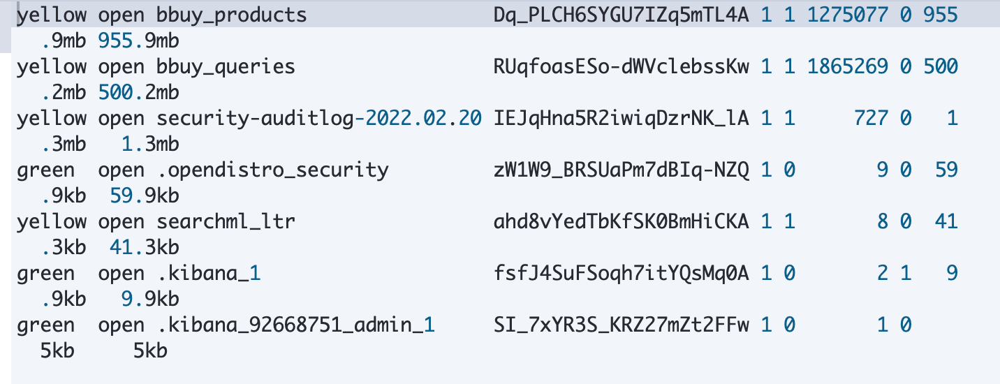
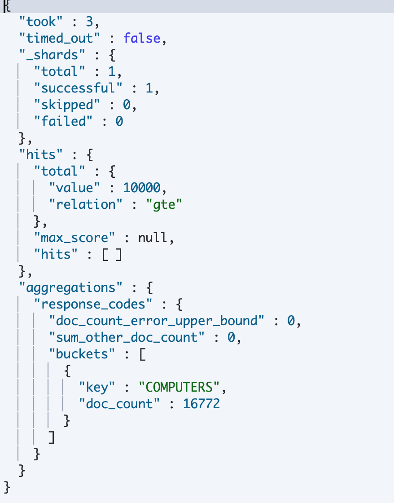
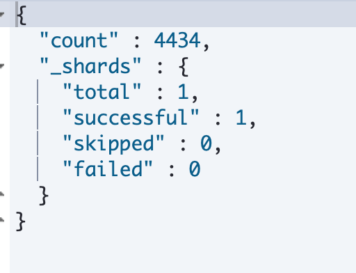
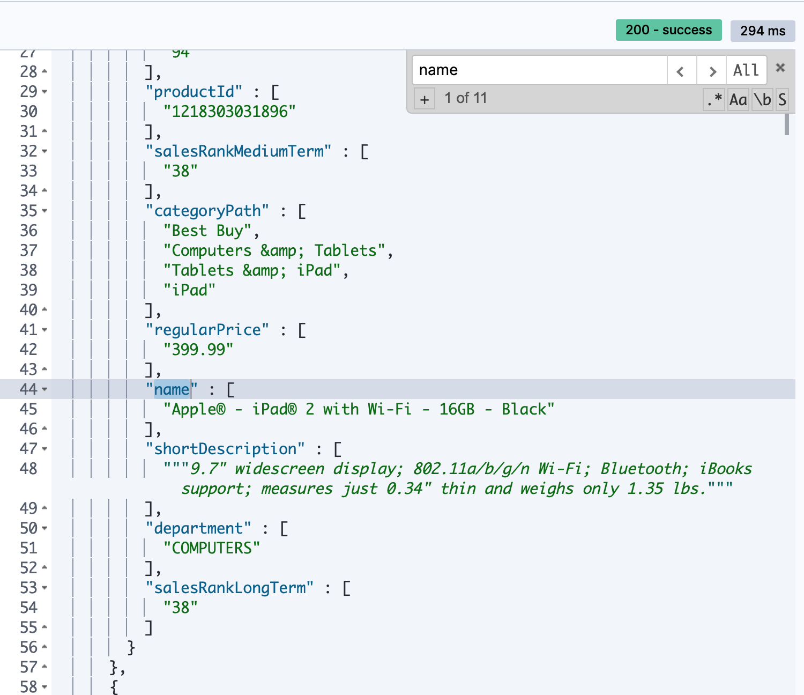

## Week1 Assessment

1. **Do your counts match ours?**

    **Number of documents in the Product index**: 1,275,077
    **Number of documents in the Query index**: 1,865,269

    

    ```
    GET /_search
    {
    "query": {
        "match_all": {}
    }
    
    }

    GET _cat/indices/?pretty&s=store.size:desc
    ```

    There are 16,772 items in the “Computers” department when using a “match all” query (“*”) and faceting on “department.keyword”.
    

    ```
    GET bbuy_products/_search
    {
    "query": {
        "match_all": {}
    },
    "size": 0,
    "aggs": {
        "response_codes": {
        "terms": {
            "field": "department.keyword",
            "include": "COMPUTERS",
            "size": 10
        }
        }
    }
    }
    ```

    **Missing an image field**

    **Number of documents missing an “image” field**: 4,434
    
    ```
    GET bbuy_products/_count
    {
        "query": {
            "bool": {
                "must_not": {
                    "exists": {
                        "field": "image"
                    }
                }
            }
        }
    }
    ```

2. **What field types and analyzers did you use for the following fields and why?**

    a. **Name**: text keyword type field and english analyzer
    b. **shortDescription and longDescription**: text keyword type field and english analyzer
    c. **regularPrice**: float

3. **Compare your field mappings with the instructors’. Where did you align and where did you differ? What are the pros and cons of the different approaches?**    
On quick comparison, there were some other extra inputs were used like ignore malformed which I didn't use which would become handy in cases when we have malformed data coming in and 


**Were you able to get the “ipad 2” to show up in the top of your results? How many iterations did it take for you to get there, if at all?**

    - I was able to get ipad2 on the top using query below, Need to spend time to make query work on the flask web app to get it running



```
GET bbuy_products/_search
{
  "query": {
            "function_score": {
                "query":{ "multi_match": { 
                "query": "\"ipad 2\"" ,
                "fields": ["name^100", "shortDescription^50", "longDescription^10", "department"]

            }
        },
                "boost_mode": "multiply",
                "score_mode": "avg",
                 "functions": [
                    {
                        "field_value_factor": {
                            "field": "salesRankShortTerm",
                            "missing": 10000000, 
                            "modifier": "reciprocal"
                        }
                    },
                    {
                        "field_value_factor": {
                            "field": "salesRankMediumTerm",
                            "missing": 10000000,
                            "modifier": "reciprocal"
                        }
                    },
                    {
                        "field_value_factor": {
                            "field": "salesRankLongTerm",
                            "missing": 10000000,
                            "modifier": "reciprocal"
                        }
                    }
                ]               
            } 
        },
 "_source": ["productId", "name", "shortDescription", "longDescription", "department", "salesRankShortTerm",  "salesRankMediumTerm", "salesRankLongTerm", "regularPrice", "categoryPath"]        
}      
```
